# iLoveHotel

## 基于Nuxt.Js&&Vue2.X的酒店管理系统PC端

## [移动端传送门](https://github.com/lbbjzz/ilovehotel_miniapp)

### 1.项目演示地址

#### 1.1 PC端：[iLoveHotel](http://lbbjzz.com)

#### 1.2 移动端: [iLoveHotel_H5](http://h5.lbbjzz.com)

### 2.Build Setup

```bash
# install dependencies
$ npm install

# serve with hot reload at localhost:5200
$ npm run dev

# build for production and launch server
$ npm run build
$ npm run start

# generate static project
$ npm run generate
```

### 3.系统结构：

#### 3.1.基本流程：

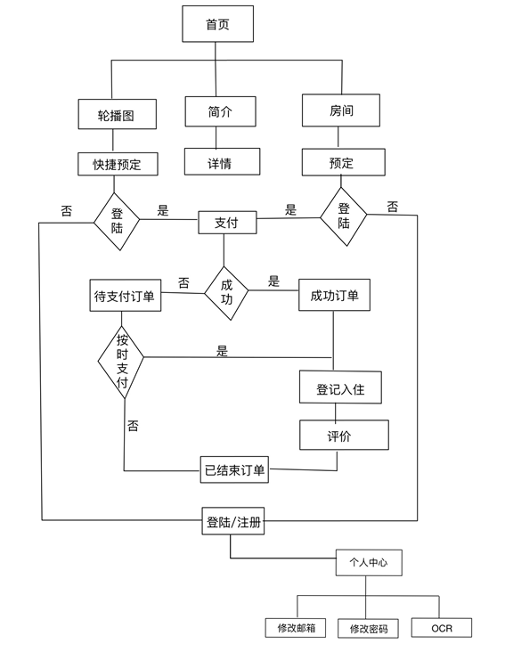

#### 3.2.主要模块：

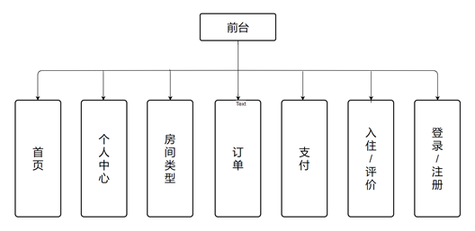

##### 3.2.1.登录/注册模块：

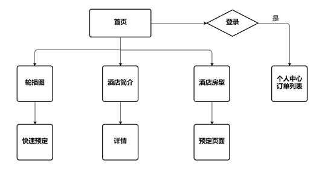

##### 3.2.2.首页模块

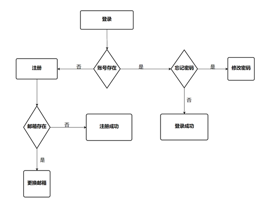

##### 3.2.3.房间预定模块：

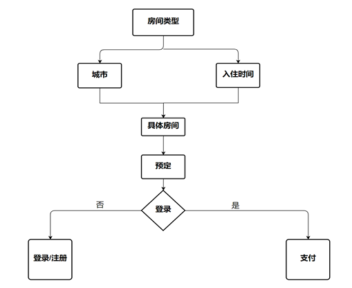

##### 3.2.4.支付模块

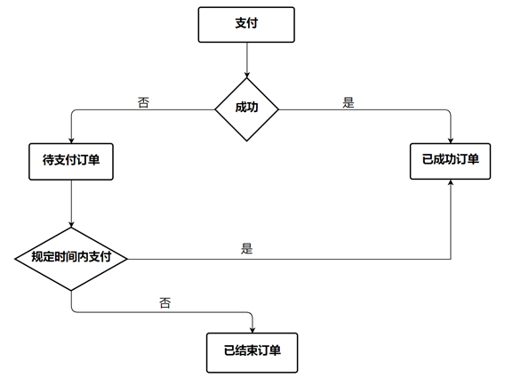

##### 3.2.5.订单模块

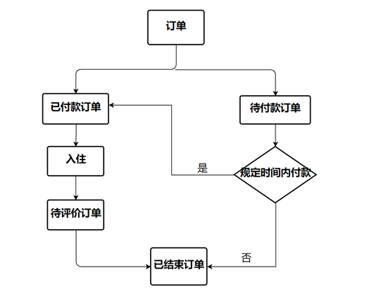

##### 3.2.6.入住/评价模块

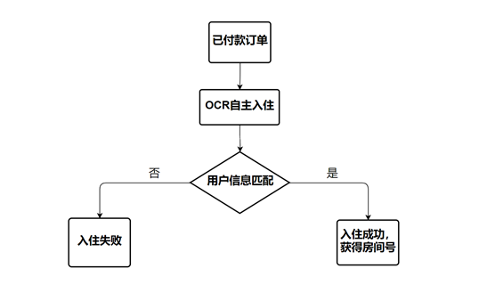

##### 3.2.7.个人中心模块

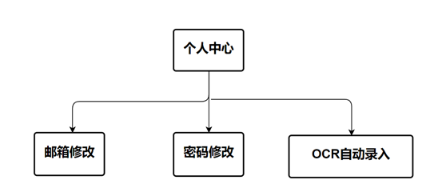

#### 4.主要页面预览

##### 4.1.登录/注册


##### 4.2.首页


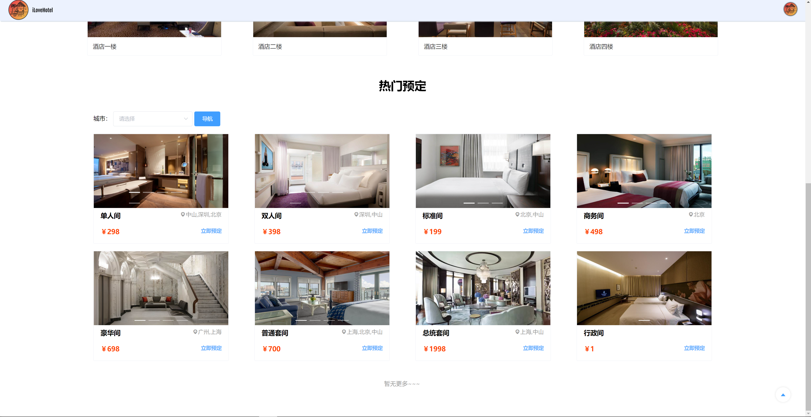

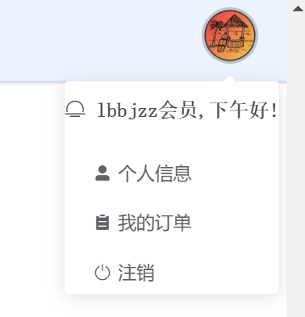

##### 4.3.个人中心

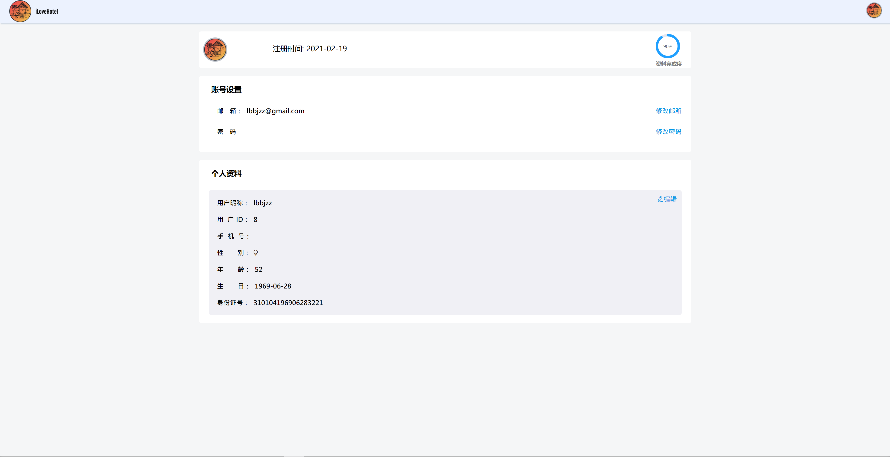

##### 4.4.订单列表

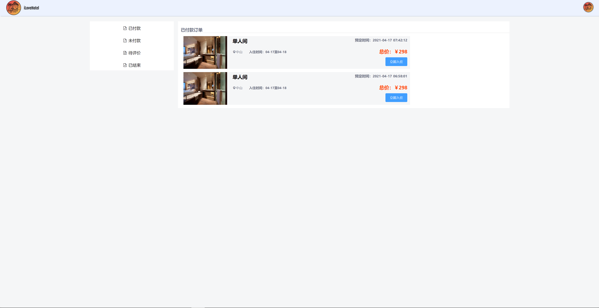

##### 4.5.预定

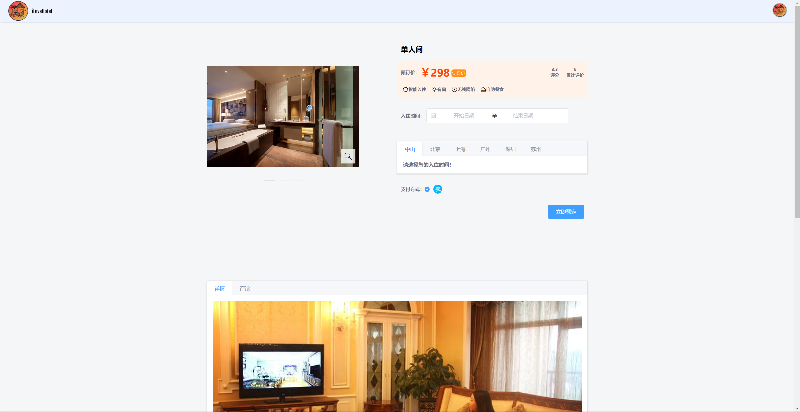

##### 4.6.评论列表


---

## 系统前端后台：

### 基于Vue&&ElementUI的后台管理系统

### 项目地址：https://gitee.com/demo2020/hotelnew

### 演示地址：http://admin.lbbjzz.com

---

## 系统后端：

### 基于SpringBoot&&Mybatis的JavaEE系统

### 项目地址：https://gitee.com/leejcee/Hotel-Management-System


